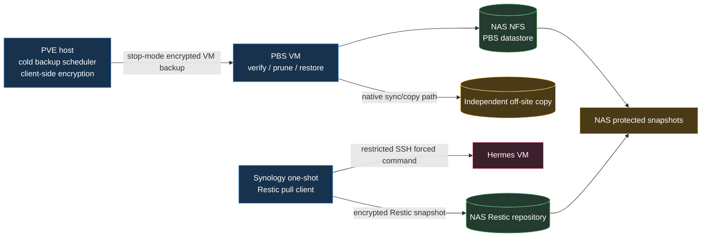

# Unified Hermes backup safety specification

**Status:** Proposed

**Scope:** Existing PVE/PBS/NAS cold backups and the live Synology/Restic application backup

**Migration baseline:** The implementation on `main` is deployed and remains in service during migration

## 1. Purpose

This specification defines one layered backup system for the Hermes VM. It combines:

1. **Cold machine recovery:** Proxmox VE (PVE) stops the Hermes VM cleanly and sends an encrypted image backup to Proxmox Backup Server (PBS), whose datastore is hosted on the Synology NAS.
2. **Live application recovery:** A one-shot client on Synology pulls the forced-command Hermes export over SSH and writes it to an encrypted Restic repository.
3. **Failure-domain recovery:** Protected NAS snapshots and an off-site copy preserve recovery points if the NAS or its administrators are compromised or the site is lost.

The two local backup paths are complementary. PBS is the authoritative whole-machine recovery path and is controlled outside the guest. Restic provides application-consistent, granular, and portable recovery without restoring an entire VM. Neither local path alone protects against loss of the NAS because both repositories reside there.

The key words **MUST**, **MUST NOT**, **SHOULD**, **SHOULD NOT**, and **MAY** describe implementation requirements.

## 2. Current production baseline

The migration starts from a working deployment, not a greenfield design.

- Hermes runs as a VM under PVE.
- PVE performs cold backups to PBS.
- PVE encrypts PBS backup data client-side before PBS and the NAS store it.
- PBS runs on Synology and uses a dedicated NAS-backed datastore.
- Synology runs the `main` branch Compose deployment as a scheduled one-shot container.
- The container pulls `server/hermes-backup-stream` over restricted SSH and sends the stream directly to Restic with `--stdin-from-command`.
- The stream contains restore instructions plus the supported Hermes ZIP export.
- Restic content, the SSH private key, and the Restic password remain absent from the Hermes VM.
- The container is non-root, read-only, capability-free, and uses tmpfs for transient files.
- Daily retention, weekly pruning, and weekly repository checks are scheduled on Synology.

These controls MUST remain operational until their replacements have completed backup and restore acceptance tests. Migration MUST NOT create a window with no verified recovery path.

## 3. Goals

The unified design MUST:

1. Preserve independent machine-level and application-level recovery paths.
2. Keep PBS credentials, the PVE client encryption key, Restic credentials, and NAS credentials out of the Hermes guest.
3. Keep backup scheduling outside the Hermes guest.
4. Make the cold PVE/PBS backup the trustworthy recovery path when guest-provided application output is suspect.
5. Preserve the existing application-consistent Hermes stream.
6. Remove mutable Git checkout and Compose files from scheduled root execution on Synology.
7. Make source-side backup protocol files root-owned and non-writable by the Hermes runtime account.
8. Pin the Synology backup image by immutable digest and retain its current runtime hardening.
9. Bound live-export duration and size, and ensure producer failure creates no Restic snapshot.
10. Separate backup, check, and prune execution so each operation receives only required mounts.
11. Protect local repositories against destructive changes with NAS snapshots where supported.
12. Maintain at least one encrypted copy in a failure domain independent of the Synology NAS.
13. Monitor outcomes outside Hermes and exercise real isolated restores.
14. Support deliberate upgrades, rollback, credential rotation, and incident response.

## 4. Non-goals

This specification does not:

- prove that application data emitted after guest compromise is truthful;
- protect secrets from live root compromise of the system that legitimately uses them;
- treat encryption as protection from deletion;
- claim that two repositories on one NAS satisfy 3-2-1 backup requirements;
- require a new dedicated backup-gateway host while PVE/PBS supplies the independent machine-level control plane;
- require the application exporter to make a hostile guest trustworthy;
- require automatic deployment of newly published container images;
- require automatic pruning with the routine PBS backup token; or
- allow production and a credential-identical restored Hermes VM to run concurrently.

## 5. Threat model and trust boundaries

Hermes is an Internet-connected AI agent and MUST be treated as a potentially compromised data source. It can alter its data, stall, fail, or emit malformed, incomplete, oversized, or malicious output. It cannot be allowed to control backup schedules, repositories, retention, or recovery credentials.

PVE, PBS, Synology, the image release workflow, and recovery operators are trusted administrative components. Compromise of one of them remains possible, so credentials and recovery copies are divided where practical and destructive actions are protected by snapshots, off-site copies, and operator procedures.

| Component | Authority | Must not receive |
| --- | --- | --- |
| Hermes guest | Produces live application export | Restic/PBS credentials, NAS credentials, PVE encryption key, retention or deletion authority |
| PVE | Stops and backs up the VM; encrypts PBS data client-side | NAS administrator credentials |
| PBS | Stores, verifies, prunes, and restores VM backups | PVE client encryption key or guest credentials |
| Synology NAS | Hosts PBS and Restic storage; runs the Restic pull client | PVE client encryption key; unrelated guest or PVE credentials |
| Restic backup container | Pulls one export and creates a local snapshot | PBS credentials; NAS/PVE administration credentials |
| Release workflow/GHCR | Builds and distributes the backup image | Runtime SSH or Restic secrets |
| Off-site target | Stores encrypted recovery data | Client decryption keys |
| Recovery operator | Holds or retrieves recovery keys and authorizes restores | Routine unattended access unless operationally required |

A compromised Hermes guest may poison future application exports. The cold PVE/PBS path is independent of guest backup code and preserves earlier full-machine recovery points, but a backup taken after compromise may still contain the compromised state. Monitoring, retention, and restore isolation remain mandatory.

## 6. Target architecture



### 6.1 Recovery-path ownership

| Recovery need | Primary path | Why |
| --- | --- | --- |
| Complete VM loss, broken OS, uncertain application state | PVE/PBS cold backup | Captured outside the guest and restores the complete machine |
| Hermes data rollback | Restic application backup | Application-consistent and faster/granular to inspect or import |
| NAS loss or site disaster | Off-site encrypted PBS copy | Independent storage failure domain; can restore the whole VM |
| Suspected guest compromise | Pre-compromise PBS image, isolated first boot | Does not rely on current guest exporter behavior |
| Portable data migration | Restic application bundle | Stable TAR containing the supported Hermes export |

The application repository MAY also be copied off-site. This improves granular recovery but MUST NOT delay establishing an off-site whole-VM path.

## 7. Cold PVE/PBS backup requirements

### 7.1 Backup mode and guest isolation

- PVE MUST schedule the Hermes VM backup outside the guest.
- The production backup mode MUST perform an orderly stop before capture. PVE MAY resume the VM after the stopped state has been established and the background backup process starts.
- The Hermes guest MUST NOT hold the PBS API token or PVE client encryption key.
- The guest network MUST NOT reach PVE, PBS, or NAS management interfaces.
- Guest-agent quiescing MAY improve behavior but MUST NOT be treated as a security boundary.

### 7.2 PBS access and encryption

- PVE MUST use client-side encryption for the PBS storage entry.
- The exact existing AES JSON key MUST have two protected recovery copies outside PVE, PBS, and the NAS, such as a password manager and encrypted offline media.
- Disaster recovery MUST upload the existing key. It MUST NOT generate a replacement key when restoring old encrypted backups.
- The PBS API token used by PVE MUST have only the permissions required to create and restore its owned backup groups. Retention and datastore administration SHOULD remain server-side.
- Token and user ACLs MUST be verified as an effective least-privilege intersection.

### 7.3 NAS-backed PBS datastore

- The datastore MUST remain on a dedicated Synology Btrfs shared folder exported only to the PBS VM.
- NFS MUST use a hard mount, synchronous-safe behavior, stable numeric ownership, and a mount arrangement that cannot silently write into an empty local mount point when NFS is absent.
- The PBS `backup` identity MUST be tested for create, write, rename, sync, and delete on the mounted datastore.
- Shared-folder compression and Recycle Bin SHOULD remain disabled because PBS already compresses data and garbage collection must reclaim chunks.
- Capacity MUST be monitored using Synology shared-folder usage, not only PBS-reported filesystem capacity.
- The PBS VM backup MUST exclude the datastore itself; PBS configuration is reconstructable and the datastore is reattachable.

### 7.4 PBS maintenance

Backup, verification, prune, and garbage collection windows MUST not overlap. Initial cadence SHOULD be:

- daily prune outside the backup window;
- daily cold PVE backup;
- weekly verification with periodic reverification of older snapshots; and
- weekly garbage collection in a separate I/O window.

The deployed schedule MAY differ, but every job MUST report failures and the NAS must retain capacity headroom for snapshots and maintenance.

## 8. Live application-export contract

### 8.1 SSH authorization

The Synology pull key MUST be unique to Hermes and authorized with the equivalent of:

```text
from="NAS_SOURCE_IP",restrict,command="/usr/local/libexec/hermes-backup/export" ssh-ed25519 PUBLIC_KEY synology-hermes-backup
```

The authorization MUST:

- force one absolute command;
- reject a nonempty `SSH_ORIGINAL_COMMAND`;
- prohibit shell, PTY, forwarding, agent forwarding, X11, and user RC files;
- restrict the observed source address where stable addressing permits; and
- be independently revocable.

The client MUST use `BatchMode=yes`, `IdentitiesOnly=yes`, `StrictHostKeyChecking=yes`, and a separately provisioned `known_hosts` file. Host-key fingerprints MUST be verified out of band.

### 8.2 Installed exporter

The target deployment MUST replace the user-writable `/home/anton/.local/bin/hermes-backup-stream` protocol entrypoint with root-owned files equivalent to:

```text
/usr/local/libexec/hermes-backup/                 root:root 0755
/usr/local/libexec/hermes-backup/export           root:root 0755
/home/anton/.cache/hermes-backup/                 anton     0700
```

The wrapper MUST:

- use fixed absolute executable paths;
- not trust environment overrides for executables or helpers;
- remain non-writable by the Hermes runtime account;
- reserve stdout exclusively for the TAR stream;
- send status and errors to stderr;
- create private temporary directories;
- install cleanup traps before creating sensitive temporary data; and
- fail nonzero on any incomplete or inconsistent export.

A repository-supplied idempotent Ansible playbook SHOULD install and remove these files and manage only a marked backup block in `authorized_keys`. It MUST preserve unrelated authorization entries and support two restricted keys during rotation.

### 8.3 Stream contents and consistency

On success the forced command MUST emit one uncompressed TAR containing:

```text
RESTORE.txt
hermes/hermes.zip
```

The exporter MUST:

1. invoke the supported Hermes backup command;
2. require a nonempty Hermes archive;
3. exclude lock, WAL, SHM, runtime, and reinstallable environment files;
4. emit restore instructions describing only the archives actually present; and
5. remove temporary plaintext after success, failure, or handled termination.

Additional tool state MAY be added to the bundle later under its own top-level directory. Any such addition MUST document its own consistency method and MUST NOT weaken the guarantees above.

The NAS MUST treat the stream as untrusted bytes during ingestion and MUST NOT extract it as part of the scheduled backup path.

## 9. Synology Restic client target

### 9.1 Image publication

The target image SHOULD be published as `ghcr.io/OWNER/hermes-nas-backup` by a protected release workflow.

- Releases MUST publish a semantic version, source-commit tag, and immutable manifest digest.
- Synology MUST deploy the digest, never a moving `latest` tag.
- The workflow MUST run tests, ShellCheck, an image smoke test, vulnerability policy, SBOM generation, and artifact attestation before release.
- Workflow actions and the base image MUST be pinned to reviewed immutable revisions.
- Runtime secrets MUST NOT enter image layers, build arguments, workflow logs, or registry metadata.
- A public package is preferred so Synology does not need a long-lived GHCR credential. A private package requires a separate read-only package token.

### 9.2 Fixed one-shot containers

Synology SHOULD replace scheduled `docker-compose run` from the Git checkout with fixed, stopped containers created from the verified image digest:

| Container | Mode | Secret/config mounts |
| --- | --- | --- |
| `hermes-backup-daily` | `backup` | Restic password, SSH key, `known_hosts` |
| `hermes-backup-check` | `check` | Restic password only |
| `hermes-backup-prune` | `prune` | Restic password only |

Production containers MUST:

- run as fixed non-root UID/GID `65532:65532`, after confirming those IDs are unused on the NAS;
- use a read-only root filesystem;
- drop all capabilities;
- enable `no-new-privileges`;
- have no Docker socket, host device, privileged mode, published port, or auto-restart;
- use bounded tmpfs for `/tmp` with `noexec,nosuid,nodev`;
- mount only the repository and operation-specific secret/config files; and
- remain stopped between one-shot runs.

DSM Task Scheduler MUST start existing containers by fixed name using an absolute Docker path. It MUST NOT build an image, pull a moving tag, run Compose from a Git checkout, or execute an application script writable by an interactive DSM user.

The scheduler command MUST attach/wait and propagate the container exit code. A deliberate failure MUST trigger DSM abnormal-task notification before migration is accepted.

### 9.3 Secrets and configuration

- The SSH private key and Restic password MUST be individual read-only file mounts from a dedicated encrypted Synology location.
- The secret location MUST be denied to unrelated DSM users and excluded from SMB, NFS, FTP, WebDAV, Synology Drive, indexing, and unrelated synchronization or backup jobs.
- `known_hosts` is not secret but is integrity-sensitive; it MUST be root-owned and non-writable by the container identity.
- Secret values MUST NOT appear in environment variables, Docker commands, image metadata, logs, Git, or monitoring payloads.
- The repository MUST be a separate shared folder from the secret store.
- At least two independent recovery copies of the Restic password and Synology encryption recovery material MUST exist outside the NAS.

Manual unlock after reboot provides the strongest at-rest boundary. An external key manager or remote KMIP MAY be used when unattended recovery is required. No local unlock design protects mounted secrets from live DSM root.

### 9.4 Backup behavior and hostile-output bounds

The backup mode MUST:

1. acquire a non-blocking run lock;
2. verify repository, password, SSH key, and trusted-host material;
3. enforce a whole-run timeout covering SSH, stream transfer, and Restic finalization;
4. reject empty or undersized output;
5. reject oversized output without accepting a silently truncated stream;
6. invoke Restic with `--stdin-from-command` so a nonzero SSH/exporter exit creates no snapshot;
7. use stable `--host`, `--tag`, and `--stdin-filename` values;
8. compute the SHA-256 digest and byte length of the received stream as it passes to Restic;
9. emit a run manifest describing what was received;
10. report the created snapshot identifier; and
11. clean tmpfs material on all handled exits.

The live stream SHOULD continue directly into Restic rather than being written as a plaintext NAS archive. Initial minimum/maximum byte and duration limits MUST be replaced with measured values plus documented headroom.

The digest and byte length MUST be computed on the NAS over the bytes actually received, never taken from a source-supplied value. Inserting the digest computation MUST NOT buffer the stream to a plaintext NAS file, suppress the exporter's exit status, or prevent Restic from cancelling the snapshot on producer failure.

### 9.4.1 Run manifest

Each backup attempt MUST produce one manifest record containing at least:

- schema version;
- UTC start and finish times;
- source identifier and verified SSH host-key fingerprint;
- exporter/SSH exit status;
- received byte length;
- SHA-256 digest of the received stream;
- deployed image digest; and
- the resulting Restic snapshot identifier, or the reason no snapshot was created.

The manifest MUST be emitted for failed attempts as well as successful ones, because an attempt that produced no snapshot is precisely the event that leaves no other trace in the repository.

The manifest MUST be retained outside the Restic repository, MUST be durable for at least the snapshot retention period, and MUST NOT contain secret values.

The manifest MUST NOT be carried in Restic tags. Retention groups by host and tags, so a per-run tag value would place every snapshot in its own retention group and defeat the policy in section 9.5.

A recorded digest is evidence about transfer, not about truthfulness. It proves which bytes the NAS received and stored, and allows a restored snapshot to be re-hashed and compared. It does not establish that a compromised Hermes produced honest data; that guarantee comes only from the cold PVE/PBS path in section 7.

### 9.5 Retention, checks, and pruning

- Daily backup MAY run `forget` only after a successful snapshot.
- Daily backup MUST NOT run `prune`.
- Weekly check and prune MUST run in separate non-overlapping windows.
- Check and prune containers MUST NOT receive the Hermes SSH key.
- Retention MUST select the same stable host and tag used during backup.
- A full-data check and representative restore MUST occur periodically; metadata checks alone are insufficient.

## 10. Deletion resistance and off-site recovery

### 10.1 Local NAS protection

PBS and Restic MUST reside in separate dedicated shared folders. Where supported, Synology protected or immutable Btrfs snapshots SHOULD cover both folders with schedules that do not overlap active PBS verification/GC or Restic pruning.

The protection window MUST exceed the expected time to detect compromise or backup failure. Fourteen days is a reasonable initial minimum, but the final period must be based on capacity and incident-detection requirements.

Snapshot retention, repository retention, and off-site retention are separate policies. Deleting data through PBS or Restic does not necessarily free NAS capacity while Btrfs snapshots retain the underlying blocks.

### 10.2 Independent failure domain

The system is not 3-2-1 compliant until an encrypted copy exists outside the Synology NAS and local site.

The preferred first off-site milestone is a native PBS sync/copy path to a separately administered PBS or supported remote target. It MUST preserve encrypted backup content and retention long enough to survive the expected detection interval. Routine replication credentials SHOULD be unable to delete protected remote history.

If application-level off-site recovery is added, it SHOULD use an append-only Restic-compatible endpoint or immutable storage with independent transport credentials. The remote service MUST not receive the repository decryption password.

## 11. Monitoring and evidence

Authoritative backup monitoring MUST run outside the Hermes guest. Hermes-emitted success messages MUST NOT determine backup health.

Operators MUST be alerted for:

- missed PVE or Restic schedules;
- nonzero exporter, SSH, Restic, PVE, PBS, verification, prune, GC, or sync jobs;
- changed SSH or PBS fingerprints;
- live-export size or duration outside established bounds;
- overlapping tasks;
- Synology shared-folder quota pressure;
- absent or expired protected snapshots;
- stale or failed off-site replication; and
- failed restore drills.

Operators MUST be able to determine:

- last attempt and last success for each backup path;
- PVE VMID, PBS datastore, backup mode, and backup snapshot time;
- PVE client-encryption fingerprint, but not the key value;
- deployed Restic image digest and container exit code;
- latest Restic snapshot ID, host, tag, size, and duration;
- the run manifest for any recent attempt, including attempts that created no snapshot;
- the received byte length and stream digest trend across runs, so an abrupt change in export size or a repeated identical digest is visible;
- last PBS verification, prune, and garbage-collection results;
- last Restic check and prune results;
- current NAS protected-snapshot horizon;
- latest successful off-site copy; and
- latest successful isolated restore from each required path.

Logs MUST use UTC and MUST NOT contain private keys, passwords, API token secrets, authorization headers, full process environments, or decrypted backup content.

## 12. Restore safety

### 12.1 PBS VM restore

A restored Hermes VM MUST use a new unused VMID and MUST have **Start after restore** and **Live restore** disabled. Before first boot:

- disable autostart;
- disconnect the virtual NIC (`link_down=1` or equivalent);
- ensure no route to the Internet, production, NAS, PVE/PBS management, or backup networks; and
- validate through the PVE console.

Production and the restored clone MUST never run online concurrently because they contain duplicated Hermes, OAuth, gateway, and messaging credentials. To test service functionality, stop production first, enable only the restored guest, complete the test, stop and disconnect the restore, restart production, and verify production reconnection before deleting the test VM.

### 12.2 Application restore

Restic content originated in the guest and MUST be treated as untrusted. Restore into a disposable isolated environment as an unprivileged identity. Before import:

- reject absolute paths and path traversal;
- prevent device creation, setuid/setgid restoration, capabilities, and unsafe ownership;
- handle symlinks without permitting writes outside the restore root;
- inspect the TAR and embedded Hermes ZIP; and
- keep networking disabled until inspection is complete.

At least quarterly, perform a representative application restore. At least annually, perform off-site-only recovery using protected key copies. A monthly lightweight canary restore is recommended.

## 13. Migration plan from `main`

Migration MUST be incremental and reversible.

### Phase 0 — Record and verify the live baseline

1. Record current NAS paths, schedules, image ID, Restic repository, stable host/tag, and SSH fingerprints without recording secret values.
2. Run the existing tests.
3. Confirm a current Restic snapshot can be restored and its Hermes ZIP validates.
4. Confirm the latest cold PBS backup verifies and can be restored with networking disconnected.
5. Back up the PVE AES key, Restic password, and Synology recovery material to two protected external locations.

**Gate:** both current recovery paths have successful restore evidence.

### Phase 1 — Protect the source protocol

1. Add the idempotent Hermes-host Ansible installer.
2. Install the root-owned exporter under `/usr/local/libexec/hermes-backup/`.
3. Add a second restricted key entry if key rotation is required.
4. Test a complete backup through the existing NAS client.
5. Remove the legacy authorization that invokes the user-writable exporter.

**Gate:** arbitrary commands are rejected, the exporter path is not runtime-user-writable, and a producer failure creates no Restic snapshot.

### Phase 2 — Replace mutable NAS execution

1. Add the protected GHCR release workflow and publish the first attested image.
2. Create encrypted secret/config locations outside the Git checkout.
3. Create fixed daily, check, and prune containers from the verified digest.
4. Disable old Compose schedules before testing the new containers against the existing repository.
5. Run snapshots, check, backup, and representative restore tests.
6. Validate DSM failure propagation and notifications.
7. Enable fixed-container schedules and observe at least two successful cycles.

**Gate:** no scheduled root task evaluates the Git checkout, Compose file, build context, or user-writable script.

### Phase 3 — Protect local history

1. Enable and verify protected Btrfs snapshots for PBS and Restic shared folders.
2. Set quotas and alerts with sufficient backup, maintenance, and snapshot-growth headroom.
3. Separate all maintenance windows.

**Gate:** a tested protected snapshot survives an attempted ordinary repository deletion and remains restorable.

### Phase 4 — Establish independent recovery

1. Configure an encrypted off-site PBS copy in a different administrative and physical failure domain.
2. Test a copy, verify it remotely, and perform an off-site-only isolated restore.
3. Optionally add append-only off-site application backups.

**Gate:** complete Hermes VM recovery succeeds without the production Synology NAS.

### Phase 5 — Retire the Compose deployment

Only after the rollback window and all earlier gates pass:

1. remove old DSM tasks;
2. remove obsolete containers and local build cache;
3. revoke obsolete SSH keys;
4. remove old plaintext secret copies;
5. retain the old repository unchanged until its approved retention end; and
6. remove the NAS Git checkout from every privileged execution path.

The existing Restic repository MUST NOT be reinitialized during migration.

## 14. Upgrade, rollback, and rotation

### 14.1 Image upgrade

Pause schedules, pull and verify the new digest, create candidate containers, run snapshots/check/test backup, preserve the old digest and stopped containers during rollback, then switch fixed production names and resume scheduling. Restic repository-format compatibility MUST be reviewed before upgrade.

### 14.2 SSH key rotation

Add a second restricted public key, test a complete backup with the new private key, remove the old authorization, verify rejection of the old key, and update recovery records. The private key MUST originate on the NAS secret store or another approved final trusted host.

### 14.3 Restic key rotation

Add and test a new Restic key before removing the old key, atomically update the mounted password file, test snapshots/check/restore, and update both protected recovery copies. If decrypted repository data or its master key may have been exposed, create a new repository with new master material; password rotation alone is insufficient.

### 14.4 PVE encryption key handling

The PVE client encryption key is stable recovery material. Copy and test the exact existing AES JSON key; do not rotate it merely to match routine token rotation. If it is compromised, establish a new encrypted backup lineage and preserve the old key only as long as old backups remain required.

## 15. Incident response

| Incident | Required response |
| --- | --- |
| Suspected Hermes compromise | Stop destructive retention, preserve pre-compromise points, isolate guest, prefer pre-compromise PBS restore, inspect application exports as hostile |
| Suspected Synology compromise | Revoke source pull key, suspend Restic and PBS maintenance, preserve/offline off-site copy, rebuild NAS/PBS services, rotate NAS-held credentials |
| Suspected PVE compromise | Revoke PBS token, preserve PBS/NAS and off-site history, rebuild PVE, restore the existing client key only after trust is re-established |
| Suspected PBS compromise | Revoke API token, preserve NAS snapshots/off-site copy, rebuild PBS, safely reattach datastore, verify before reconnecting PVE |
| Repository corruption | Stop prune/GC, preserve storage snapshots, identify last verified point, recover from protected snapshot or off-site copy |
| NAS loss | Rebuild/reattach PBS from off-site data, upload existing PVE AES key, restore Hermes isolated, then reconstruct granular Restic service as needed |

## 16. Initial service objectives

Unless replaced by measured requirements:

| Objective | Initial target |
| --- | --- |
| Cold VM backup RPO | 24 hours |
| Live application backup RPO | 24 hours |
| Missed-backup detection | 36 hours |
| Local machine restore initiation | 4 hours |
| Off-site-only restore initiation | 8 hours |
| Local protected-history window | At least 14 days |
| Off-site protected-history window | At least 30 days |
| Application restore drill | Quarterly |
| Full off-site disaster-recovery drill | Annually |

## 17. Acceptance checklist

### Cold recovery

- [ ] PVE cold backup completes with `TASK OK`.
- [ ] PBS stores client-side encrypted data and does not possess the PVE AES key.
- [ ] PVE backup token has no datastore administration authority.
- [ ] PBS verification reports zero errors.
- [ ] Restore to a new VMID boots with networking disconnected.
- [ ] Production and restored clones are never online concurrently.
- [ ] The exact preserved PVE AES key has been tested in an isolated recovery procedure.

### Live application recovery

- [ ] Root-owned forced command rejects shell, PTY, forwarding, and arbitrary commands.
- [ ] Hermes export validation succeeds.
- [ ] Exporter failure, timeout, undersize, and oversize create no Restic snapshot.
- [ ] Every attempt, including a deliberately failed one, produces a retained run manifest.
- [ ] A restored snapshot re-hashes to the digest its manifest recorded.
- [ ] Scheduled containers are digest-pinned and do not execute the Git checkout.
- [ ] Check and prune containers have no SSH private-key mount.
- [ ] A representative Hermes restore succeeds in isolation.

### Storage and operations

- [ ] PBS and Restic repositories have protected NAS snapshots.
- [ ] Quota and free-space alerts use Synology's actual shared-folder accounting.
- [ ] An encrypted whole-VM copy exists outside the Synology failure domain.
- [ ] Off-site-only restore succeeds.
- [ ] Two protected external copies exist for every required decryption/recovery key.
- [ ] Monitoring detects missed schedules and deliberate task failures.
- [ ] Upgrade, rollback, rotation, and incident procedures have named owners.

## 18. Required implementation deliverables

Implementation of this specification is complete only when the repository contains:

1. An idempotent Hermes-host Ansible installer and removal procedure.
2. A versioned exporter stream contract.
3. Whole-run timeout and source byte-bound enforcement with failure tests.
4. Inline stream digest/length accounting and a versioned run-manifest record, with tests covering a failed attempt.
5. A protected GHCR image publishing workflow with test, scan, SBOM, provenance, and attestation stages.
6. Native fixed-container creation templates for backup, check, prune, snapshots, and init.
7. Synology encrypted-secret, ACL, UID/GID, scheduler, quota, and protected-snapshot instructions.
8. PVE/PBS schedule, encryption-key recovery, verification, and isolated-restore instructions.
9. Off-site PBS copy and off-site-only recovery instructions.
10. Monitoring and alert verification instructions.
11. Upgrade, rollback, credential rotation, incident response, and migration runbooks.

## 19. Primary references

- [Proxmox Backup Server documentation](https://pbs.proxmox.com/docs/)
- [Proxmox Backup client-side encryption](https://pbs.proxmox.com/docs/backup-client.html#encryption)
- [Proxmox Backup permissions](https://pbs.proxmox.com/docs/user-management.html)
- [Restic command-aware stdin](https://restic.readthedocs.io/en/stable/040_backup.html#reading-data-from-stdin)
- [Restic append-only security considerations](https://restic.readthedocs.io/en/stable/060_forget.html#security-considerations-in-append-only-mode)
- [OpenSSH authorized-key restrictions](https://man.openbsd.org/sshd.8)
- [Synology immutable snapshots](https://kb.synology.com/en-us/DSM/help/SnapshotReplication/snapshots)
- [Docker container security options](https://docs.docker.com/engine/containers/run/)
- [GitHub artifact attestations](https://docs.github.com/en/actions/security-for-github-actions/using-artifact-attestations)
